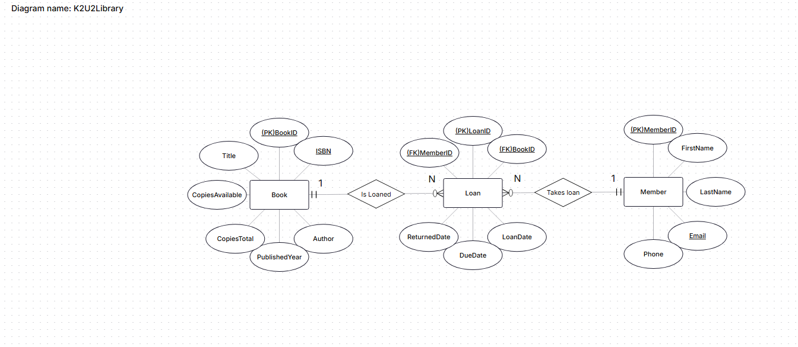

# K2U2-Library SQL Project
Overview

# *All files related to the project are in the branch Master*

This project implements a small library system with books, members, loans, and automated tracking of available copies.
The database enforces loan rules at the database level to ensure that books cannot be loaned when no copies are available, while preserving historical loan data.

Database Structure

Book
Stores books with:

CopiesTotal

CopiesAvailable

Member
Stores library members.

Loan
Tracks which member has borrowed which book, including:

LoanDate

DueDate

ReturnDate (NULL = active loan)

LoanLog
Logs loan and return actions for auditing purposes.

Stored Procedure & Views
usp_RegisterLoan

All new loans are created using the usp_RegisterLoan stored procedure.

Verifies that CopiesAvailable > 0 before inserting a loan

Inserts a loan with ReturnDate = NULL

Throws an error and rolls back the transaction if no copies are available

This guarantees that invalid loans cannot be created.

Active Loans View

vw_ActiveLoans

Defines active loans as records where ReturnDate IS NULL

Used for reporting and verification

Ensures active loans are clearly separated from historical data

Triggers

Triggers are used to enforce data integrity even if inserts or updates bypass the stored procedure.

trg_DecreaseCopiesOnLoan
Decreases CopiesAvailable when a new active loan is inserted.

trg_IncreaseCopiesOnReturn
Increases CopiesAvailable when a loan is returned (ReturnDate is set).

trg_LogLoanActions
Logs all loan and return actions into LoanLog.

Triggers ensure that availability cannot become negative and that all actions are logged.

Inventory Consistency

Before testing, book availability is synchronized using the following logic:

CopiesAvailable = CopiesTotal - ActiveLoans

This guarantees a consistent baseline state, even when historical loans exist in the database.

SQL Scripts / Files

create_tables_and_inserts.sql
Creates the database, tables, sample books, members, and initial loan data.

stored_procedure.sql
Creates usp_RegisterLoan.

triggers.sql
Creates all triggers (decrease, increase, logging).

backfill_loanlog.sql (optional, one-time)
Populates LoanLog for pre-existing loans.

verify_inventory.sql (optional)
Verifies that:

CopiesAvailable + ActiveLoans = CopiesTotal

test_loans.sql (recommended)
Executes controlled test cases to validate loan behavior and error handling.

Usage

Run create_tables_and_inserts.sql

Run stored_procedure.sql

Run triggers.sql

(Optional) Run backfill_loanlog.sql

(Optional) Run verify_inventory.sql

Run test_loans.sql to validate behavior

Result

Books cannot be loaned if no copies are available

Availability remains accurate at all times

Historical loan data is preserved

Business rules are enforced at the database level

All key scenarios are tested and verified

## Console Application

The console application interacts with the K2U2Library database and provides a simple menu-driven interface to:

- Register new books
  - Validates ISBN, title, author, published year, and total copies
  - Confirms details before saving
- Register new members
  - Validates first name, last name, email, and phone
  - Confirms details before saving
- Register new loans
  - Checks member and book existence
  - Ensures copies are available
  - Confirms before saving
- Register returns
  - Allows returning a book by specifying LoanID
- Show active loans
  - Displays all loans where ReturnDate IS NULL
  - Shows member full name, book title, loan and due dates
- Search books
  - Allows searching by title, author, or ISBN
 
## Reflections & Optimizations

- **Triggers** ensure CopiesAvailable is always accurate and all loan/return actions are logged.
- **Stored procedure** prevents invalid loans and enforces business rules at the database level.
- **Views** provide convenient reporting (active loans, overdue loans, borrowing history, most frequent books).
- **Indexes** are applied on BookID, MemberID, and CopiesAvailable to speed up queries for loans and searches.
- **EF Database First** allows the console app to interact with the existing database without redefining models.

## Testing & Validation

- Simulated multiple loans and returns to verify copies availability logic.
- Confirmed that historical loan data is preserved in LoanLog.
- Tested concurrent loan attempts to ensure transactional integrity.
- Used verify_inventory.sql to ensure CopiesAvailable matches expected values.

ER Diagram

ENTITIES:

BOOK
(Attributes)
- BookID (PK)
- ISBN (UNIQUE)
- Title
- Author
- PublishedYear
- CopiesTotal
- CopiesAvailable

MEMBER
(Attributes)
- MemberID (PK)
- FirstName
- LastName
- Email (UNIQUE)
- Phone

LOAN
(Attributes)
- LoanID (PK)
- BookID (FK → BOOK.BookID)
- MemberID (FK → MEMBER.MemberID)
- LoanDate
- DueDate
- ReturnedDate
